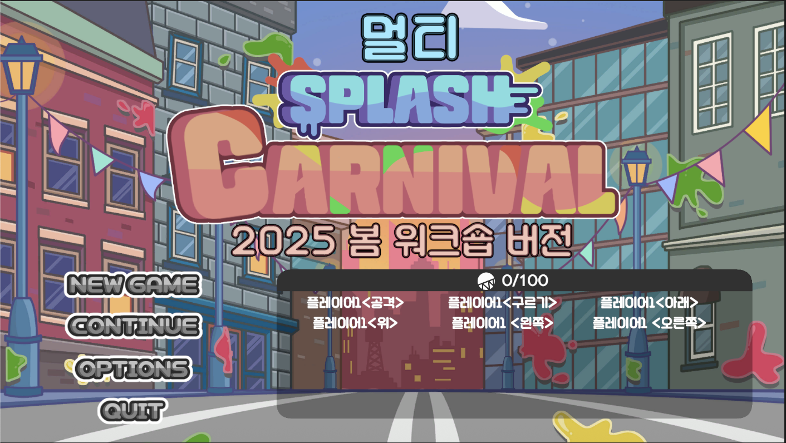
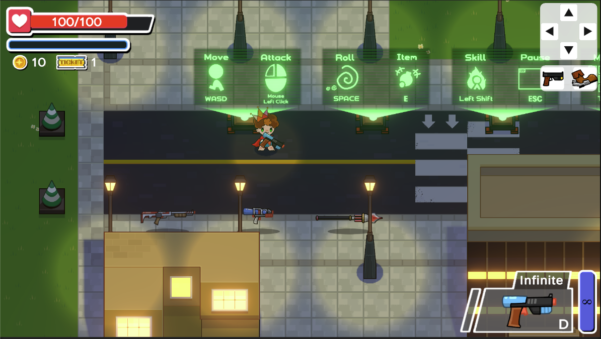

# 멀티 스플래쉬 카니발

### 설명
판도라큐브 2025 봄 워크샵용으로 제작한 게임의 서버입니다
웹사이트에 접속하면 이동, 공격, 구르기 등의 역할을 등록할 수 있습니다
여러명의 플레이어가 자신이 선택한 버튼만을 조작하여 실시간으로 스플래쉬 카니발 게임을 플레이하게 됩니다
팀에서 협동심을 발휘하여 게임을 클리어 하는 것이 목적입니다!

스플래쉬 카니발 게임은 아래 링크를 참고해주세요
[스팀 페이지](https://store.steampowered.com/app/2870950/Splash_Carnival/).

### 플레이 화면 이미지

### 사용 기술 스택
프론트: js, c# socketIO
서버: python flask
